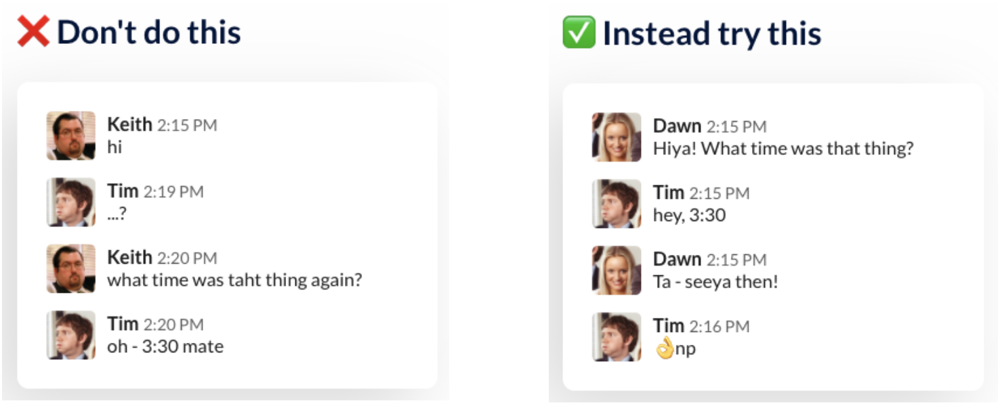

# Communication

## Async Communication

At Loadsmart, the engineering team works 100% remotely. We believe async communication is key for our day-to-day work.

### Business Time Visibility

People are working from different time zones, and we need to be aware of and respect it. For example, if we don't know your timezone or your business time, we don't know when you would be able to attend a meeting or answer a message. Two tips here:
You can set your business time using Google Calendar. With that, everybody will see it when scheduling a meeting with you.
Add this information to your Slack profile. It will be available with a single click on your Slack picture. We recommend this format `<job title> @ <squad/team/department> - Working hours: X AM - Y PM (<timezone>)`

### No Hello

When sending a message, like in Slack, we usually try to be polite by not jumping right into the request. This is not a good practice and costs time. The [No Hello](https://nohello.net) website presents a better way to do it. Please take a look.

  
   
  <i>Image by <a href="https://nohello.net">No Hello</a></i>

### Slack Notifications

It is common and useful to have Slack installed on our phones. With this, we got the notifications as well. They are very useful when we are working, but they can be very unhealthy. Receiving notifications when you are out of your business time will prevent you from disconnecting and resting. Within some time, it will cause a lot of stress. That's why we recommend setting Slack to send mobile notifications during your business hours or for really urgent channels only.

### Slack Status

Slack is your front door. People will look for you there when they need to ask or tell something. It's important to make clear if you are available or not. For that, we can use the Slack Status. For example: Out of Office, In a Meeting, Internet Connection Unstable. Setting the integration between Google Calendar and Slack will update your status automatically.

### Collaborative Docs

We have many meetings to discuss ideas or proposals. Instead of scheduling a meeting whenever a new project or problem arises, try writing about it in a Google Doc, so the team can use the comments features to have an async discussion. This way, we give people time to understand and evaluate the subject, and they can make a decision without trying to fit everyone in a call at the same time. This feature is also available in other tools like Notion.

### How to Solve a Fire

It takes time to figure out how to solve a fire, and there is always a lesson learning. This learning should be shared so that we save time in the future. After solving a fire, we recommend writing a how to fix it. The next firefighters will thank you for that.

### Meetings Outcome

With the company getting bigger and bigger, it's more likely that people won't be able to attend all the meetings they are invited to. Because of that, it's recommended to either record and/or take notes and share them after the meeting. Those who missed it can get up to date afterward. Even for recorded meetings, that is a good idea to summarize it into notes so people can save time avoiding watching the whole video. Also, we recommend using the Meetings Notes feature available on Google Calendar.

### Emails

Urgent communications should not happen via email. With that being said, we do not need to read an email as soon as it gets in our inbox. The recommendation is to set in the calendar/agenda one or two times per day to read emails. Make it a routine.

### Lock your Calendar

Organize your calendar by locking some time for lunch or other regular breaks you have. Also, lock it when you will be OOO. This will prevent you from receiving meeting invites when you cannot attend them. Company-wide meetings may still happen in these times. It is up to you to organize your time according to your priorities, both personal and at the company.